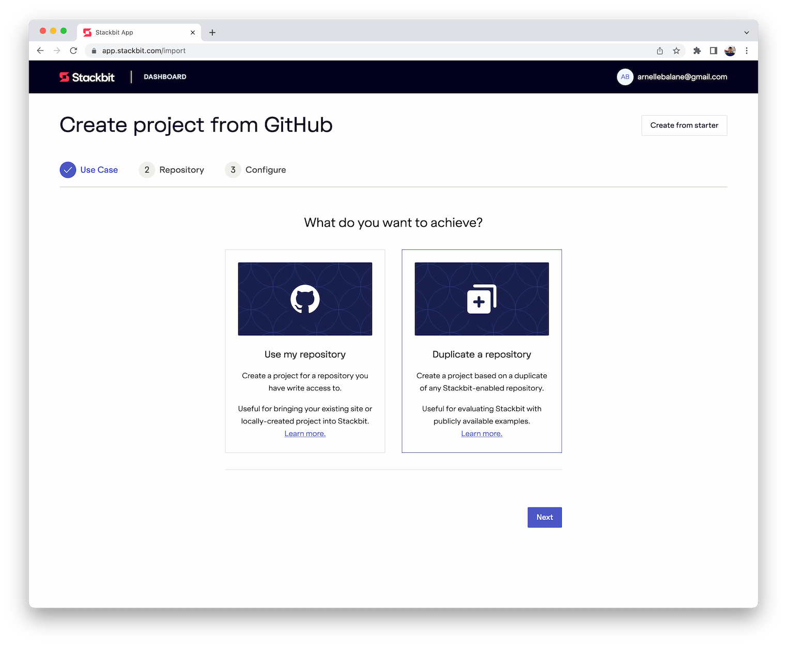
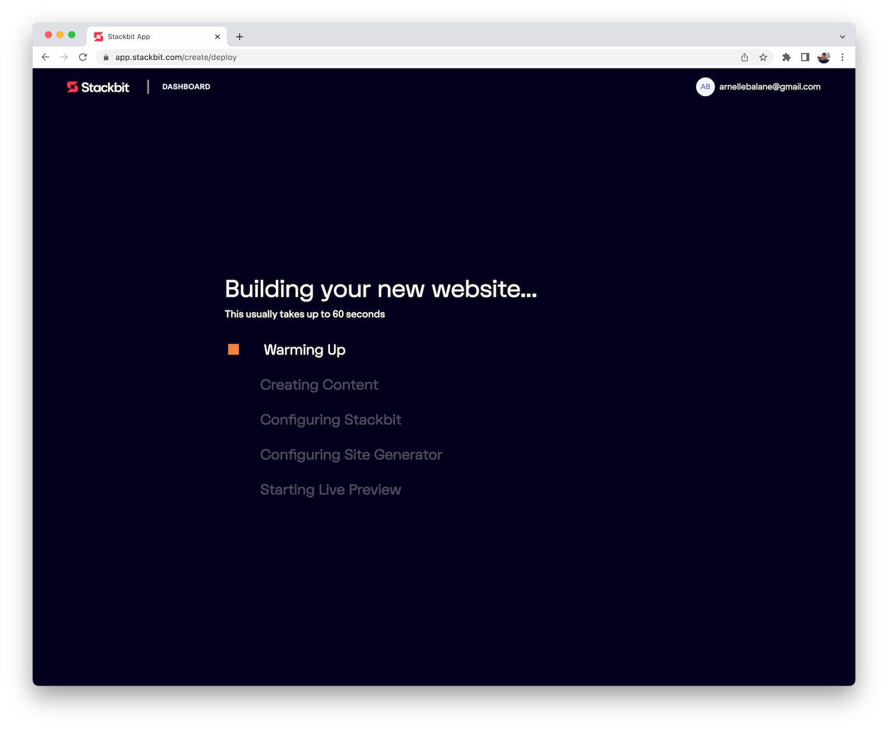

# Getting started: Let Stackbit manage the event website

This approach is useful when we don't want to maintain the project repository and take care of deployments. Stackbit can take care of these things for us. Our only way to manage our website's content is through the Stackbit editor.

1. From the Stackbit dashboard, click on the **New project** button
1. Click on the **Create from GitHub** button
1. Choose the **Duplicate a repository** option and click **Next**

   

1. In the repository field, enter the URL for this template and click **Validate**

   ```
   https://github.com/gdg-cebu/event-website
   ```

1. We can leave the advanced options with the default values and click **Next**
1. Give the project a name, then click **Create Project**
1. It will take a while to spin up a fresh project, but once it's done we can start editing the content, adding new pages, and publishing the event website.

   
