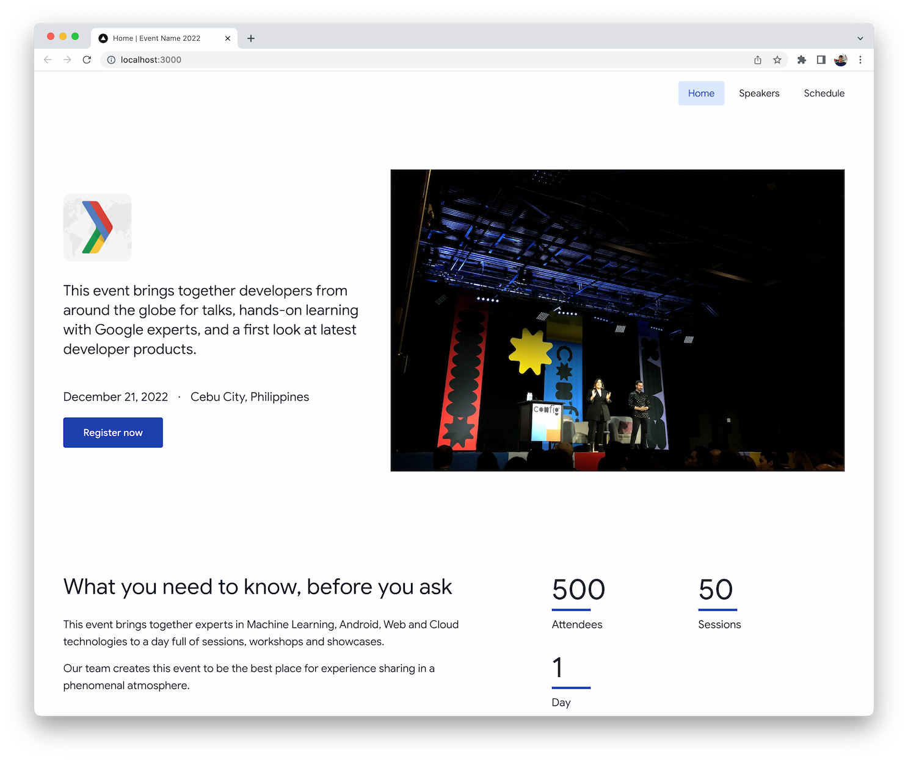

# Event Site Template

Quickly spin up a new Stackbit-enabled website for your next event. Built with [Next.js](https://nextjs.org/), [TailwindCSS](https://tailwindcss.com/), and [Stackbit](https://www.stackbit.com/).



## Getting started

There are two ways to use this template for our next event website, please follow the corresponding steps for the preferred approach.

- [Let Stackbit manage the event website (repository, deployments, etc.)](docs/stackbit-managed.md)
- [We manage the event website (repository, deployments, etc.)](docs/self-managed.md)

For both approaches, we're going to need a Stackbit account, so make sure that we already have one and we're already logged in to our account.

After creating a new project in the Stackbit dashboard, we can then invite other users into the project so they can manage the pages and content of our event website.

## Contributing

Any contribution to make this project better is welcome! Get started by cloning and running this template locally:

```bash
git clone https://github.com/gdg-cebu/event-website.git
cd event-website

npm ci
npm run prepare
npm run dev
# visit the site at http://localhost:3000

# run the stackbit editor, then follow the instructions in the console
npx stackbit dev
```

When contributing to this project,

1. Open an issue in the repository to discuss the change to be introduced
1. Work on the changes in a separate branch
1. After finishing the changes, open a pull request to the `main` branch

## License

[MIT License](license)
